# Scenario 1: Staggered Rollout with Clear Identification Strategy

## The Context

- Last year's employee engagement survey indicated a strong need for improved management skills. Additionally, leadership is concerned about consistently high manager turnover following recent organizational changes. 
- To act on this, your organization's learning and development (L&D) team designs a new leadership development program for people managers, aiming to better equip them to lead their teams through change and to decrease manager turnover. 
- The L&D team will have a mid-year review of their projects with HR leadership and needs to be prepared with early success indicators and inform whether they should continue scaling the program or make changes to the program.

------------------------------------------------------------------------

## Project Discovery

- The L&D team identified **new managers** as a priority group for next year because their engagement survey scores ranked lowest and new manager turnover has been trending higher since recent organizational changes.
- The team rejects a randomized controlled trial (RCT), as withholding training would be seen as unfair and detrimental for team stability. 
- However, since the program is still in pilot phase, they don't have the capacity to train the full new manager cohort at once.
- You propose a staggered rollout as a solution. In January, the new manager cohort is informed that, due to training capacity limits, they will be randomly assigned to participate in the program either from **Jan. - March** or **July - Sept.**
- You were able to review the cohort demographics to ensure they are **equivalent across key demographics**.
- You have access 3 key measurement milestones to illustrate early evidence of program impact:
    1. New Manager Cohort retention @ 3 months
    2. Manager and direct report responses to employee experience survey items
    3. New Manager Cohort retention @ 6 months

## The Data & Outcomes

- Cohort 1 = 150 trained managers; 1,200 exposed direct reports
- Cohort 2 (Control) = 150 trained managers; 1,200 exposed direct reports
- Employee demographics: gender, age, tenure, region, organization, job family, performance rating
- Manager Retention at 3, 6, 9, and 12 months: 0/1 indicating whether manager is retained
- Self-Report experience outcomes (1-5 scale):

| Target | Outcome | Description |
|----------|----------|----------|
| Manager   | Manager Efficacy Index   | A self-assessment of manager confidence in their ability to lead and support their team through change. |
| Team    | Manager Support Index    | Employees' assessment of their managers' ability to support and lead their team. |
| Both   | Workload Index    | A self-assessment a employee perceptions of workload, work-life balance, and well-being. |
| Both | Turnover Intention Index | A self-assessment of employees' intention to stay at the company. (High score indicates high stay intention.) |

---

## Causal Identification Strategy

### Causal DAG

Randomization breaks the link between covariates and treatment assignment, eliminating confounding by design.

```mermaid
flowchart LR
    subgraph DAG1["Scenario 1: Staggered Rollout"]
        direction LR
        
        Z["🎲 <b>Z</b><br/>Random Assignment<br/>(Lottery)"]
        T1["💼 <b>T</b><br/>Treatment<br/>(Jan-Mar Training)"]
        X1["📋 <b>X</b><br/>Covariates<br/>(Demographics, Tenure,<br/>Region, Performance)"]
        Y1["📈 <b>Y</b><br/>Outcomes<br/>(Retention, Survey Scores,<br/>Turnover Intent)"]
        
        Z --> T1
        T1 --> Y1
        X1 --> Y1
        X1 -.->|"❌ Blocked by<br/>randomization"| T1
    end
    
    style Z fill:#c8e6c9,stroke:#388e3c,color:#000
    style T1 fill:#bbdefb,stroke:#1976d2
    style X1 fill:#fff9c4,stroke:#f9a825
    style Y1 fill:#d1c4e9,stroke:#512da8
```

**Key Causal Paths:**
- **Z → T**: Random lottery determines treatment assignment
- **X → T**: Covariates do NOT influence treatment (randomization breaks this path)
- **X → Y**: Covariates still predict outcomes (but are balanced across groups)
- **T → Y**: Unconfounded causal effect of interest

---

### Decision Flow

```mermaid
flowchart TB
    START1((("Scenario 1:<br/>Staggered Rollout")))
    
    START1 --> S1
    S1["🎯 <b>Context</b><br/>150 managers randomly assigned<br/>to Jan-Mar vs July-Sept cohorts"]
    
    S1 -->|"Step 1: Assignment"| A1
    A1["✅ <b>RANDOM ASSIGNMENT</b><br/>Staggered rollout with lottery"]
    
    A1 -->|"Step 2: Covariate Overlap"| COV1
    COV1["✅ <b>NONE (By Design)</b><br/>Groups equivalent on demographics<br/>No selection bias expected"]
    
    COV1 -->|"Step 3: Estimand"| EST1
    EST1["📊 <b>ATT = ATE</b><br/>Equivalent under randomization<br/>Effect generalizes to population"]
    
    EST1 -->|"Step 4: Method"| METHOD1
    METHOD1["🔧 <b>GEE + Robust SEs</b><br/>• Accounts for team clustering<br/>• Exchangeable correlation<br/>• Heteroskedasticity-consistent SEs"]

    style START1 fill:#1565c0,stroke:#0d47a1,color:#fff
    style S1 fill:#bbdefb,stroke:#1976d2
    style A1 fill:#c8e6c9,stroke:#388e3c
    style COV1 fill:#c8e6c9,stroke:#388e3c
    style EST1 fill:#d1c4e9,stroke:#512da8
    style METHOD1 fill:#b2dfdb,stroke:#00796b
```

---

## Why GEE with Robust SEs?

- **Randomization** handles confounding → no propensity weighting needed
- **GEE** accounts for clustered data (direct reports nested under managers)
- **Robust SEs** protect against heteroskedasticity and mild model misspecification

| Decision | Choice |
|----------|--------|
| **Assignment** | Random (lottery) |
| **Selection Bias** | None by design |
| **Covariate Balance** | Verified equivalent |
| **Estimand** | ATT ≈ ATE |
| **Primary Method** | GEE + Robust SEs |
| **Doubly Robust?** | Not required |

